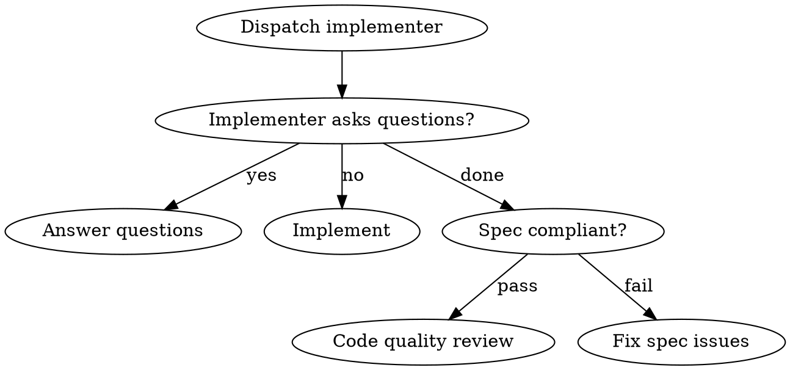

# Superpowers Design Patterns

## Overview

**Project:** Superpowers - AI coding agent workflow system
**Repository:** `/Users/sheldon/Documents/claw/reference/superpowers`
**Version:** 5.0.6

---

## Pattern Index

1. Frontmatter-Driven Discovery
2. Flowchart-Driven Process Control
3. Rationalization Tables
4. TDD-Applied-to-Documentation
5. Cross-Platform Polyglot Hooks
6. Interface Segregation for Skills
7. Two-Stage Review Pattern
8. File-Based IPC Pattern
9. Zero-Dependency Server Pattern
10. Controller/Subagent Coordination Pattern

---

## P-01: Frontmatter-Driven Discovery

**Category:** Discovery Pattern
**Evidence:** `skills/*/SKILL.md`

Skills use YAML frontmatter for discovery by AI agents. The `description` field serves as the triggering condition.

**File:** `skills/test-driven-development/SKILL.md`

```yaml
---
name: test-driven-development
description: Use when implementing any feature or bugfix, before writing implementation code
---
```

**Usage:** Agents read frontmatter `description` fields to decide whether to invoke a skill. This is AI-native discovery, not keyword matching.

---

## P-02: Flowchart-Driven Process Control

**Category:** Process Pattern
**Evidence:** `skills/subagent-driven-development/SKILL.md`

Complex skills use Graphviz flowcharts (`digraph`) to define decision trees.

**File:** `skills/subagent-driven-development/SKILL.md`



**Benefits:** Visual process representation, decision point clarity, loop/iteration handling.

---

## P-03: Rationalization Tables

**Category:** Discipline Enforcement Pattern
**Evidence:** `skills/test-driven-development/SKILL.md`, `skills/systematic-debugging/SKILL.md`

Discipline-enforcing skills include explicit tables of rationalizations and responses to prevent circumvention.

**File:** `skills/test-driven-development/SKILL.md`

```markdown
| Excuse | Reality |
|--------|---------|
| "I'll test after" | Tests passing immediately prove nothing. |
| "Just this once" | Delete code. Start over. |
```

**Purpose:** Pre-empt common agent rationalizations that bypass disciplined processes.

---

## P-04: TDD-Applied-to-Documentation

**Category:** Meta Pattern
**Evidence:** `skills/writing-skills/SKILL.md`

The `writing-skills` skill itself applies TDD methodology.

**Cycle:**
1. **RED:** Run baseline scenario without skill, document rationalizations
2. **GREEN:** Write skill addressing those rationalizations
3. **REFACTOR:** Close loopholes, re-test until bulletproof

**File:** `skills/writing-skills/SKILL.md`

```markdown
## TDD for Skills

1. **RED phase:** Run the scenario WITHOUT the skill you're writing
2. **GREEN phase:** Write the skill to address those failure modes
3. **REFACTOR:** Close the loopholes your first draft missed
```

---

## P-05: Cross-Platform Polyglot Hooks

**Category:** Platform Pattern
**Evidence:** `hooks/run-hook.cmd`

The `run-hook.cmd` uses a polyglot pattern (shell script embedded in cmd batch file) to work on both Windows and Unix.

**File:** `hooks/run-hook.cmd`

```batch
: << 'CMDBLOCK'
@echo off
REM Windows: cmd.exe runs batch portion
...
:CMDBLOCK

# Unix: shell interprets this as script
SCRIPT_DIR="$(cd "$(dirname "$0")" && pwd)"
exec bash "${SCRIPT_DIR}/${SCRIPT_NAME}" "$@"
```

**Mechanism:** Both languages ignore the other's syntax block. Windows runs the batch portion, Unix runs the shell portion.

---

## P-06: Interface Segregation for Skills

**Category:** Coupling Pattern
**Evidence:** `skills/*/SKILL.md`

Skills reference each other via explicit requirement markers rather than force-loading.

**Pattern:**
```markdown
**REQUIRED SUB-SKILL:** Use superpowers:test-driven-development
```

**NOT:**
```markdown
@skills/path/file.md
```

**Rationale:** Avoids forced loading of entire skill content. Agents decide when to load referenced skills.

---

## P-07: Two-Stage Review Pattern

**Category:** Quality Assurance Pattern
**Evidence:** `skills/subagent-driven-development/SKILL.md`

The subagent-driven development skill uses two-stage review after each task:

**Stages:**
1. **Spec compliance review** - Did implementation match requirements?
2. **Code quality review** - Is implementation well-built?

**File:** `skills/subagent-driven-development/SKILL.md`

```
Task Complete → Spec Reviewer → [Pass] → Code Quality Reviewer
                         ↓
                      [Fail] → Implementer fixes → Re-review
```

**Purpose:** Prevents both under-building (missed requirements) and over-building (YAGNI violations).

---

## P-08: File-Based IPC Pattern

**Category:** Communication Pattern
**Evidence:** `skills/brainstorming/scripts/server.cjs`

Visual companion uses filesystem (screen files + events file) rather than in-memory state or database.

**Flow:**
- Screen updates: Write HTML to `screen_dir/`, server watches and serves newest
- User events: Server writes clicks to `state_dir/events` as JSONL
- Agent reads events file on next turn

**File:** `skills/brainstorming/scripts/server.cjs`

```javascript
// Screen updates via filesystem
fs.writeFileSync(path.join(screenDir, 'screen.html'), content);

// User events via JSONL
fs.appendFileSync(eventsFile, JSON.stringify(event) + '\n');
```

**Rationale:** Survives server restarts, debuggable, works across process boundaries.

---

## P-09: Zero-Dependency Server Pattern

**Category:** Infrastructure Pattern
**Evidence:** `skills/brainstorming/scripts/server.cjs`

Visual brainstorming server uses only Node.js built-in modules.

**File:** `skills/brainstorming/scripts/server.cjs`

```javascript
const crypto = require('crypto');
const http = require('http');
const fs = require('fs');
const path = require('path');
// No npm dependencies
```

**Design decisions:**
- Raw Node.js `http` and `crypto` modules only
- 30-minute idle timeout prevents orphaned servers
- Owner process tracking auto-shuts down if parent dies

---

## P-10: Controller/Subagent Coordination Pattern

**Category:** Orchestration Pattern
**Evidence:** `skills/subagent-driven-development/`

Controller pattern where main agent coordinates specialized subagents.

**Architecture:**
```
Controller (main agent)
    │
    ├──> Implementer Subagent (Task N)
    │         │
    │         ├──> Spec Reviewer Subagent ──> [Pass] ──> Code Quality Reviewer
    │         │              ↑
    │         │              └── [Fail] ──> Implementer fixes ──> Re-review
    │         │
    │         └── [Fail] ──> Implementer escalates
    │
    ├──> [Next Task]...
    │
    └──> Final Code Reviewer Subagent
```

**Subagent Communication:** Status reporting via structured format:
- `DONE` - Task completed successfully
- `DONE_WITH_CONCERNS` - Completed but with doubts
- `NEEDS_CONTEXT` - Missing information to proceed
- `BLOCKED` - Cannot complete task

**File:** `skills/subagent-driven-development/implementer-prompt.md`

---

## Pattern Relationship Map

```
Frontmatter-Driven Discovery
    ↓
Skills invoke via description matching

Flowchart-Driven Process Control
    ↓
Complex skills (subagent-driven-development, systematic-debugging)

Two-Stage Review Pattern
    ↓
Used within Controller/Subagent Coordination

Rationalization Tables
    ↓
Enforce discipline in TDD, debugging skills

TDD-Applied-to-Documentation
    ↓
Used to create new skills (writing-skills)

Interface Segregation for Skills
    ↓
Enables lazy loading between skills

Cross-Platform Polyglot Hooks
    ↓
Platform Integration Layer

File-Based IPC Pattern
    ↓
Visual Brainstorming Subsystem

Zero-Dependency Server Pattern
    ↓
Visual Brainstorming Subsystem
```
