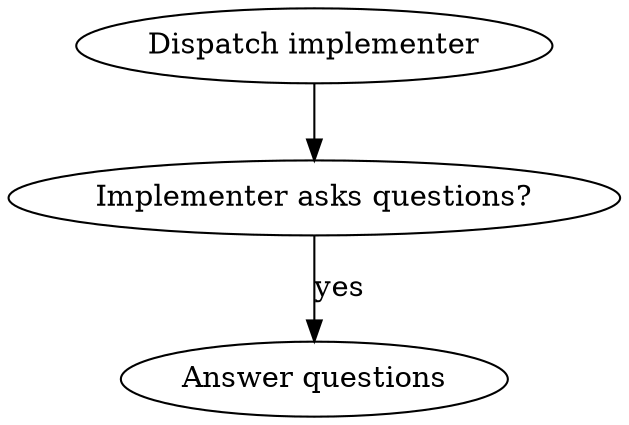

# Lessons Learned: Building Superpowers

## Project Context

Studied the Superpowers project (v5.0.6) - a complete software development workflow for AI coding agents via composable skills. 407 commits over 5 months, single dominant contributor (Jesse Vincent, ~95% of commits).

---

## Key Lessons: What to Emulate

### 1. Zero-Dependency Architecture Eliminates Supply Chain Risk

**Example:** The brainstorm server (`server.cjs`, 355 lines) implements RFC 6455 WebSocket protocol from scratch using only Node.js built-ins (`crypto`, `http`, `fs`, `path`). The project deliberately removed 714 vendored files.

**Why it works:** Single auditable file, no version conflicts, no frozen vulnerabilities, works in restricted environments. The security analysis (08-security-perf.md) confirms: "No external attack surface. All code is auditable in a single 355-line file."

**Emulate this:** When adding dependencies, ask if built-in modules suffice. The cost of a dependency is ongoing maintenance and trust.

---

### 2. Iron Law Patterns Prevent Rationalization

**Example from TDD skill:**
```
NO PRODUCTION CODE WITHOUT A FAILING TEST FIRST
```

**Example from Systematic Debugging:**
```
NO FIXES WITHOUT ROOT CAUSE INVESTIGATION FIRST
```

**Example from Verification Before Completion:**
```
NO COMPLETION CLAIMS WITHOUT FRESH VERIFICATION EVIDENCE
```

**Why it works:** The all-caps "Iron Law" framing with explicit prohibitions prevents the "just this once" rationalization that undermines discipline. The research notes these appear "4+ times throughout the skill in different contexts" for "bulletproofing."

**Emulate this:** When you need to enforce a discipline, use Iron Law language with no exceptions documented.

---

### 3. Rationalization Tables Name Common Excuses Explicitly

**Example from TDD:**
| Excuse | Rebuttal |
|--------|----------|
| "Tests after achieve same goals" | Tests-after = "what does this do?" Tests-first = "what should this do?" |
| "Already manually tested" | Ad-hoc, no record, can't re-run, not comprehensive |
| "TDD will slow me down" | TDD faster than debugging. Pragmatic = test-first. |

**Example from Verification Before Completion:**
| Excuse | Reality |
|--------|----------|
| "Should work now" | RUN the verification |
| "I'm confident" | Confidence != evidence |
| "Just this once" | No exceptions |

**Why it works:** Naming excuses removes their power. When an agent (or human) thinks "just this once," the table provides an immediate, specific counter-argument.

**Emulate this:** For any discipline-enforcing process, create a rationalization table. This is more effective than general guidance.

---

### 4. Fresh Context Construction Beats Inheritance

**From Subagent-Driven Development:** "Don't make subagent read plan file (provide full text instead)."

**The implementer subagent receives complete context upfront** (task text, scene-setting, directory) rather than inheriting session history.

**Why it works:** Session history accumulates context that may not be relevant to the current task. Fresh construction gives exactly what's needed.

**Emulate this:** When dispatching work to subagents or creating task briefs, construct the context fresh rather than assuming inherited context is correct.

---

### 5. Spec Compliance Before Code Quality (Enforced Order)

**From Subagent-Driven Development:** "Start code quality review before spec compliance is [WRONG ORDER]"

**The reasoning:**
- Spec compliance checks if the RIGHT thing was built
- Code quality checks if the thing was built RIGHT
- You must confirm direction before checking execution

**Why it works:** Fixing code quality on the wrong implementation is wasted effort. The order is architecturally enforced.

**Emulate this:** When doing review, always check "are we building the right thing?" before "are we building it right?"

---

### 6. TDD Applied to Skill Creation

**From Writing Skills:** "Writing skills IS Test-Driven Development applied to process documentation."

**The TDD mapping:**
| TDD Concept | Skill Creation |
|-------------|----------------|
| Test case | Pressure scenario with subagent |
| Test fails (RED) | Agent violates rule without skill (baseline) |
| Test passes (GREEN) | Agent complies with skill present |
| Refactor | Close loopholes while maintaining compliance |

**Why it works:** Skills must survive contact with rationalizing agents. Testing with pressure scenarios (time pressure, sunk cost, authority) exposes loopholes before deployment.

**Emulate this:** Before creating any process documentation or workflow guide, run the scenario without the guide to see what failures occur. Then write the guide to address those failures.

---

### 7. Blocking Verification Steps

**From Finishing a Development Branch:** Tests must pass before presenting merge options. "This step BLOCKS progression."

**Why it works:** Humans (and agents) want to finish. Without blocking verification, broken code gets merged.

**Emulate this:** Identify the point of no return in any workflow and make verification blocking, not optional.

---

### 8. Fine-Grained Task Decomposition (2-5 Minutes)

**From Writing Plans:** Each step is one action, estimated at 2-5 minutes of AI execution time.

**Example task structure:**
1. Write the failing test - step
2. Run it to make sure it fails - step
3. Implement the minimal code to make the test pass - step
4. Run the tests and make sure they pass - step
5. Commit - step

**Why it works:** Short tasks prevent context overflow, enable precise verification, and make progress visible.

**Emulate this:** When planning, decompose until each step is 2-5 minutes of execution time.

---

### 9. No Placeholders Policy

**From Writing Plans:** Plans must never contain:
- "TBD", "TODO", "implement later", "fill in details"
- "Add appropriate error handling" / "add validation" / "handle edge cases"
- "Similar to Task N" (must repeat code)
- References to types/functions not defined in any task

**Why it works:** Placeholders defer thinking. A plan with placeholders is not a plan.

**Emulate this:** Any time you write a plan, if you see a placeholder, stop and fill it in. If you can't fill it in, you don't understand the problem yet.

---

### 10. Structured Options (Exactly 4)

**From Finishing a Development Branch:** Presents exactly 4 options - no more, no less.

```
1. Merge back to <base-branch> locally
2. Push and create a Pull Request
3. Keep the branch as-is (I'll handle it later)
4. Discard this work
```

**Why it works:** Open-ended questions ("what should I do?") are ambiguous. Four options are concrete enough to decide on, flexible enough to cover real use cases.

**Emulate this:** When presenting choices, present exactly 4 options. If fewer exist, that's fine. If more want to be added, group them.

---

### 11. Hard Gates Prevent Shortcuts

**From Brainstorming:** `<HARD-GATE>` Do NOT invoke any implementation skill, write any code, scaffold any project, or take any implementation action until you have presented a design and the user has approved it. `</HARD-GATE>`

**Why it works:** Without a hard gate, the temptation to "just start coding" overwhelms design thinking. The gate forces the right behavior.

**Emulate this:** Identify the hard gates in your workflow and mark them explicitly with `<HARD-GATE>` / `</HARD-GATE>` or similar.

---

### 12. Model Tiering for Cost Efficiency

**From Subagent-Driven Development:**
```
Mechanical implementation (1-2 files, clear spec) --> Fast/cheap model
Integration/judgment (multi-file, pattern matching) --> Standard model
Architecture/design/review --> Most capable model
```

**Why it works:** Not every task needs the most capable (expensive) model. Using the right tier reduces cost and latency.

**Emulate this:** When dispatching tasks, match model capability to task complexity.

---

## Key Lessons: What to Avoid

### 1. Avoid No TypeScript

The project is pure JavaScript. Verdict from code quality analysis: "Type Safety: None. Pure JavaScript, no type checking."

**Risk:** Runtime type errors only discovered through testing or execution. `server.cjs` uses untyped Buffers, HTTP objects, file system APIs.

**Why they accepted this:** Zero-dependency philosophy extends to build tools. TypeScript would require a compilation step.

**Recommendation:** Consider TypeScript for server.cjs specifically - best ROI with minimal new code.

---

### 2. Avoid No CI Enforcement

The project has no GitHub Actions, no required status checks, no branch protection enforced programmatically. The detailed PR template requirements are "Human-enforced, not enforced by tooling."

**Risk:** PR template checkboxes can be left unchecked. Blank sections don't prevent merge.

**Recommendation:** Add GitHub Actions to verify PR template sections are filled.

---

### 3. Avoid Missing Test Coverage for Plugin Code

**Finding:** "Main plugin (`superpowers.js`): NONE - No tests for plugin bootstrapping, skill loading, or config injection."

**Risk:** Changes to plugin loading break in production, not in tests.

**Recommendation:** Add integration tests for `superpowers.js`.

---

### 4. Avoid JSON.parse Without Try/Catch in helper.js

```javascript
ws.onmessage = (msg) => {
  const data = JSON.parse(msg.data);  // Can throw if malformed
  // ...
};
```

**Risk:** Malformed server messages crash the helper script.

**Recommendation:** Wrap in try/catch with graceful degradation.

---

### 5. Avoid Starting on Main/Master Without Explicit Consent

The skills explicitly prohibit: "Never start implementation on main/master without explicit consent."

**Risk:** History gets polluted with work-in-progress commits on the main branch.

**Recommendation:** Always use worktrees or branches for feature work.

---

### 6. Avoid Accepting "Close Enough" on Spec Compliance

From Subagent-Driven Development: "Never accept 'close enough' on spec compliance."

**Risk:** Gradual drift from requirements leads to implementations that "technically work" but don't meet needs.

**Recommendation:** Be exact. If it doesn't match the spec, it doesn't pass.

---

### 7. Avoid Skipping Verification Before Claiming Completion

From Verification Before Completion: "Claiming work is complete without verification is dishonesty, not efficiency."

**Risk:** Bugs ship. Issues surface in production. Trust erodes.

**Recommendation:** Before claiming any status, run the verification command and show the output.

---

## Surprises

### 1. Visual Companion Uses File-Based IPC

The brainstorm server uses filesystem (screen files + events JSONL) rather than in-memory state:

- Screen updates: Write HTML to `screen_dir/`, server watches and serves newest
- User events: Server writes clicks to `state_dir/events` as JSONL
- Agent reads events file on next turn

**Why this is clever:** Survives server restarts, debuggable, works across process boundaries. The research notes: "File-based IPC for Visual Companion" is an architectural decision with rationale documented.

---

### 2. Deep Platform Support

The project supports: Claude Code, Cursor, Codex, OpenCode, Gemini CLI.

**Evidence of effort:** Platform-specific plugins in `.claude-plugin/`, `.cursor-plugin/`, `.opencode/`, `.codex/`, `gemini-extension.json`. Reference docs for Codex tools and Gemini tools in `skills/using-superpowers/references/`.

---

### 3. Single-Maintainer with High Standards

Despite 95%+ commits from one person, the project has:
- Detailed PR template with 10+ required sections
- Adversarial testing requirements for skills
- 407 commits in 5 months

**Surprising:** High contribution standards without a team to enforce them.

---

### 4. Commands Deprecated in Favor of Skills

The `commands/` directory contains files that simply redirect to skills:
- `commands/brainstorm.md` - deprecation notice
- `commands/execute-plan.md` - deprecation notice
- `commands/write-plan.md` - deprecation notice

**Shows evolution:** From command-based to skill-based invocation. Skills are the primary unit.

---

### 5. The "Claude Search Optimization Trap"

**Finding:** Description should ONLY describe triggering conditions, NOT summarize the skill's workflow.

**Why this matters:** Testing revealed that when a description summarizes the skill's workflow, Claude may follow the description instead of reading the full skill content.

```yaml
# BAD: Summarizes workflow - Claude may follow this instead of reading skill
description: Use when executing plans - dispatches subagent per task with code review between tasks

# GOOD: Just triggering conditions, no workflow summary
description: Use when executing implementation plans with independent tasks in the current session
```

---

### 6. Graphviz Flowcharts Embedded in Markdown

Skills use `digraph` syntax embedded in markdown for decision trees:



**Why this works:** Visual process representation is discoverable alongside the content. `render-graphs.js` can convert to SVG.

---

## Summary

The Superpowers project demonstrates that **discipline scales better than talent**. A single-maintainer project with rigorous processes (TDD, verification gates, rationalization tables) produces higher quality work than projects relying on individual skill.

**Core principles to carry forward:**
1. Zero dependencies where possible
2. Iron Laws prevent rationalization
3. Rationalization tables name excuses explicitly
4. Fine-grained tasks (2-5 min) prevent overwhelm
5. Verification before completion is non-negotiable
6. Fresh context beats inheritance
7. Spec before quality, always
